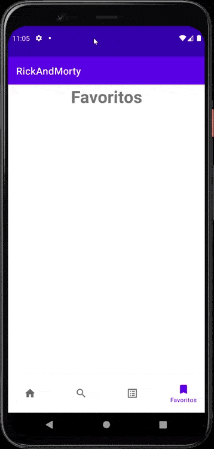

# Rick And Morty App


<p align="center">
  
</p>


 

Fuente  Api: https://rickandmortyapi.com/

Esta app sigue el patrón de diseño MVVM: 


# News App - (<https://newsapi.org/>)

Para que vayamos de forma ordenanda, seguiré el flujo de trabajo con el cual dearrollé la App. Siempre el punto de partida es el modelo, luego su interfaz, el objeto que implementa la interfaz, el repositorio, el viewmodel y eventualmente la vista. A su vez implementé algunos test insturmentales que los dejaré al final de este apartado.


### 1 - Modelo
#### Model From Json
Si una llamada típica a la API, nos devuelve lo siguiente:

```json
{
  "info": {
    "count": 826,
    "pages": 42,
    "next": "https://rickandmortyapi.com/api/character/?page=2",
    "prev": null
  },
  "results": [
    {
      "id": 1,
      "name": "Rick Sanchez",
      "status": "Alive",
      "species": "Human",
      "type": "",
      "gender": "Male",
      "origin": {
        "name": "Earth",
        "url": "https://rickandmortyapi.com/api/location/1"
      },
      "location": {
        "name": "Earth",
        "url": "https://rickandmortyapi.com/api/location/20"
      },
      "image": "https://rickandmortyapi.com/api/character/avatar/1.jpeg",
      "episode": [
        "https://rickandmortyapi.com/api/episode/1",
        "https://rickandmortyapi.com/api/episode/2",
        // ...
      ],
      "url": "https://rickandmortyapi.com/api/character/1",
      "created": "2017-11-04T18:48:46.250Z"
    },
    // ...
  ]
}
```

Entonces tendriamos los siguientes modelos:

```kotlin

data class Resultado(
    @SerializedName("created")
    var created: String = "",
    @SerializedName("episode")
    var episode: List<String> = listOf(),
    @SerializedName("gender")
    var gender: String = "",
    @SerializedName("id")
    var id: Int = 0,
    @SerializedName("image")
    var image: String = "",
    @SerializedName("location")
    var location: Location = Location(),
    @SerializedName("name")
    var name: String = "",
    @SerializedName("origin")
    var origin: Origin = Origin(),
    @SerializedName("species")
    var species: String = "",
    @SerializedName("status")
    var status: String = "",
    @SerializedName("type")
    var type: String = "",
    @SerializedName("url")
    var url: String = ""
)
```

Como vemos, cada uno de los atributos de cada clase, se corresponde con las entradas de Json.

```kotlin
      "id": 1, // ==> var id: Int = 0,
      "name": "Rick Sanchez", // ==> var name: String = "",
      "status": "Alive", // ==> var status: String = "",
```
#### Model Entity


```kotlin
@Entity(tableName = "personajes_tabla" )
data class Personaje(
    @PrimaryKey
    val id: Int = 0,
    val name: String = "",
    val status: String = "",
    val species: String = "",
    val gender : String = "",
    val originName: String = "",
    val urlOrigin : String = "",
    val locationName: String = "",
    val locationUrl: String = "",
    val image: String = "",
    val urlPersonaje: String = ""
    )
```
## 2 - API Service | DAO

#### ApiService

Utilizando RetroFit, creamos una interfaz que realizará las llamadas a la API. Nuestro objetivo es replicar la siguiente llamada
**``"https://rickandmortyapi.com/api/character/?page=2"``**

1. Usamos la anotación ``@Get`` para avisar a que es una llamada de tipo get.
2. Como argumento, completamos la dirección luego de la urlBase
3. Usamos las anotaciones ``@Query`` para completar las diferentes secciones de el llamado:
   a. page
   
4. Es una función de tipo suspend, debido a que se ejecutará con una corrutina, ya que es de tipo asíncrono.

```kotlin
interface ApiService {

    @GET("character/")
    suspend fun todosLosPersonajes(
        @Query("page") page:Int = 1
    ): RickInfoResponse
    
    }
```

#### Dao

 Los objetos de acceso a datos o DAO, son el componente principal de Room, ya que cada DAO incluye métodos que ofrecen acceso abstracta a la base de datos(Léase: Insert, Delete, Update). Estas operaciones  son potencialmente bloqueadora de hilos, por lo cual son ejecutadas de forma suspendida. Las funciones que devuelven LiveData/Flow, no precisan ser suspendidas, ya que estas son consientes del ciclo de vida.

 ```kotlin
@Dao
interface RickDao {

    @Insert(onConflict = OnConflictStrategy.REPLACE)
    suspend fun agregarPersonaje(personaje: Personaje)

    @Insert(onConflict = OnConflictStrategy.IGNORE)
    suspend fun agregarListadoPersonajes(listadoPersonaje: List<Personaje>)

    @Query("SELECT * FROM personajes_tabla")
    fun listarPersonajesDB(): Flow<List<Personaje>>

    @Query("SELECT * FROM personajes_tabla where id =:id")
    fun personajeRandomDB(id:Int): Flow<Personaje>

    @Query("SELECT * FROM personajes_tabla WHERE name LIKE '%' || :search || '%'")
    fun buscarPersonaje2(search: String?): Flow<List<Personaje>>

    @Query("SELECT * FROM personajes_tabla WHERE name LIKE :search")
    fun buscarPersonaje(search: String?): Flow<List<Personaje>>


    @Insert(onConflict = OnConflictStrategy.REPLACE)
    suspend fun agregarPersonajeFavorito(personajeFavorito: PersonajeFavorito)

    @Delete
    suspend fun eliminarPersonajeFavorito(personaje: PersonajeFavorito)

    @Query("SELECT * FROM personajes_favoritos_tabla")
    fun listarPersonajesFavoritos(): Flow<List<PersonajeFavorito>>
}
 ```

## 3 - Retrofit Client | Room
#### Cliente RetroFit
Será el encargado de implementar la interfaz ``APIService``.

```kotlin
        private val retrofitClient by lazy {
        Retrofit.Builder()
            .baseUrl("https://rickandmortyapi.com/api/")
            .addConverterFactory(GsonConverterFactory.create())
            .build()
            .create(ApiService::class.java)
    }
```
#### Room
La explicación más detallada está [aquí](https://github.com/cavigna/Android_101/tree/main/Room_DataBase).

```kotlin
@Database(entities = [Personaje::class, PersonajeFavorito::class], version = 1, exportSchema = false)
abstract class BaseDeDatos : RoomDatabase() {
    abstract fun dao() : RickDao

    companion object {

        @Volatile
        private var INSTANCE: BaseDeDatos? = null

        fun getDataBase(context: Context): BaseDeDatos {

            return INSTANCE ?: synchronized(this) {
                val instance = Room.databaseBuilder(
                    context.applicationContext,
                    BaseDeDatos::class.java,
                    "rick_and_morty_db"
                ).fallbackToDestructiveMigration()
                    .build()
                INSTANCE = instance

                instance
            }
        }
    }
}
```

## 4 - Repositorio

Crearemos un repositorio, que tiene por argumento  el *ApiService* y el  ``Dao``.

```kotlin
class Repositorio(private val api: ApiService, private val dao: RickDao) {
    suspend fun listadoPersonajesTodosApi(pagina:Int ) = api.todosLosPersonajes(page = pagina)
    suspend fun listadoPersonajesApi() = api.todosLosPersonajes()


    suspend fun personajeRandomApi() = api.personajeAPIRandom((1..826).random())
    fun personajeRandomDB(id:Int = (1..826).random()) = dao.personajeRandomDB(id)


    suspend fun agregarListadoPersonaDB(listadoPersonaje: List<Personaje>) = dao.agregarListadoPersonajes(listadoPersonaje)


    fun listadoPersonajeDB() = dao.listarPersonajesDB()

    suspend fun agregarFavorito(personajeFavorito: PersonajeFavorito) =
        dao.agregarPersonajeFavorito(personajeFavorito)

    fun listarFavoritos() = dao.listarPersonajesFavoritos()

    suspend fun eliminarFavorito(personaje: PersonajeFavorito) = dao.eliminarPersonajeFavorito(personaje)

    fun buscarPersonaje(query:String) = dao.buscarPersonaje(query)
}

```

## 5 - ViewModel

El View Model tendrá como parámetro el repositorio y heredará de ViewModel().

```kotlin

class RickViewModel(private val repositorio: Repositorio) : ViewModel() {


    val listadoPersonajesDB = repositorio.listadoPersonajeDB().asLiveData()
    val listadoFavorito = repositorio.listarFavoritos().asLiveData()
    


    init {
        agregarListadoDB()
        agregarTodosPersonajesDB()

    }

    fun agregarListadoDB() {

        viewModelScope.launch(IO) {
            val listadoApi = repositorio.listadoPersonajesApi().resultados
            repositorio.agregarListadoPersonaDB(mapearAPItoDB(listadoApi))
        }
    }

    fun agregarTodosPersonajesDB() {

        viewModelScope.launch(IO) {
            withContext(Main) {
                for (i in 1..42) {
                    val listadoApi = repositorio.listadoPersonajesTodosApi(pagina = i).resultados
                    repositorio.agregarListadoPersonaDB(mapearAPItoDB(listadoApi))
                }
            }
        }
    }


    val personajeRandomDB = repositorio.personajeRandomDB().asLiveData()

    fun funPerRandomDB() = repositorio.personajeRandomDB(id = (1..826).random()).asLiveData()


    fun agregarFavorito(personajeFavorito: PersonajeFavorito) {
        viewModelScope.launch {
            repositorio.agregarFavorito(personajeFavorito)
        }
    }

    fun eliminarFavorito(personaje: PersonajeFavorito){
        viewModelScope.launch(IO){
            repositorio.eliminarFavorito(personaje)
        }
    }
    fun buscarPersonaje(query:String) = repositorio.buscarPersonaje(query).asLiveData()

}


class RickModelFactory(private val repositorio: Repositorio) : ViewModelProvider.Factory {
    override fun <T : ViewModel> create(modelClass: Class<T>): T {
        return RickViewModel(repositorio) as T
    }
}
```

Como podemos observar, la función *NO* es de tipo suspend, ya que en esta instancia efectivamente ejecutamos la corrutina asociado al Scope del viewModel.  Cuando se ejecute, guaradará los valores en una constante de tipo LiveData.
A su vez, creamos un Modelfactory el cual nos permitirá crear el viewmodel con un patron de delegación:

```kotlin
    private val viewModel by viewModels<RickViewModel> {
        RickModelFactory((application as RickApp).repositorio)
    }
```

## Intermedio - Injección de Dependencias

Google sugiere que, para reducir el *boiler plate* (entre otras virtudes), se puede crear una injección de dependencias manual. Esto lo hacemos creando una clase que herede de Application y a su vez que lo declaremos en el manifest.

```Kotlin
class RickApp: Application() {

    private val retrofitClient by lazy {
        Retrofit.Builder()
            .baseUrl("https://rickandmortyapi.com/api/")
            .addConverterFactory(GsonConverterFactory.create())
            .build()
            .create(ApiService::class.java)
    }

    private val baseDeDatos by lazy { BaseDeDatos.getDataBase(this) }

     val repositorio by lazy { Repositorio(retrofitClient,baseDeDatos.dao()) }
}}
```

```xml
    <application
        android:name=".application.RickApp".../>
        
```

## 6 - View (Fragmento)

```kotlin
class HomeFragment : Fragment() {
    private lateinit var binding: FragmentHomeBinding
    private lateinit var application: Application

    private val viewModel by viewModels<RickViewModel> {
        RickModelFactory((application as RickApp).repositorio)
    }

    override fun onCreate(savedInstanceState: Bundle?) {
        super.onCreate(savedInstanceState)
        application = requireActivity().application

    }

    override fun onCreateView(
        inflater: LayoutInflater, container: ViewGroup?,
        savedInstanceState: Bundle?
    ): View? {
        binding = FragmentHomeBinding.inflate(layoutInflater, container, false)

        viewModel.personajeRandomDB.observe(viewLifecycleOwner, { personaje->

            unidorTarjeta(personaje)

            binding.cardView.setOnLongClickListener {
                viewModel.agregarFavorito(convertirAFav(personaje))
                Toast.makeText(requireContext(), "Personaje Guardado", Toast.LENGTH_SHORT).show()
                true
            }
        })

        binding.imageViewRefresh.setOnClickListener {
            viewModel.funPerRandomDB().observe(viewLifecycleOwner, {
                unidorTarjeta(personaje = it)
            })

        }

        binding.cardView.setOnClickListener {
            viewModel.funPerRandomDB().observe(viewLifecycleOwner, {
                unidorTarjeta(personaje = it)
            })

        }

        return binding.root
    }

    private fun unidorTarjeta(personaje: Personaje?) {
        with(binding) {
            when (personaje?.status) {
                "Alive" -> imageViewCircle.setImageResource(R.drawable.green_dot)
                "Dead" -> imageViewCircle.setImageResource(R.drawable.red_dot)
            }
            textViewNombreHome.text = personaje?.name ?: ""
            textViewStatusHome.text = personaje?.status
            textViewLocationHome.text = personaje?.locationName
            textViewSpeciesHome.text = "Especie: ${personaje?.species}"
            imageViewPersonajeDelDia.load(personaje?.image)
        }
    }
}

```
# Consideraciones Finales

#### 1 - Consumo de datos Locales

*Esta aplicación consume de una API rest para almacenar TODOS los personajes enla base de datos local. Una vez que esa llamada remota finaliza, la lógica de la app se enmarca dentro de la base de datos.*

```kotlin


class RickViewModel(private val repositorio: Repositorio) : ViewModel() {
    val listadoPersonajesDB = repositorio.listadoPersonajeDB().asLiveData()
    
    init {       
        agregarTodosPersonajesDB()
    }   

    fun agregarTodosPersonajesDB() {

        viewModelScope.launch(IO) {
            withContext(Main) {
                for (i in 1..42) {
                    val listadoApi = repositorio.listadoPersonajesTodosApi(pagina = i).resultados
                    repositorio.agregarListadoPersonaDB(mapearAPItoDB(listadoApi))
                }
            }
        }
    }
}
/*
Si lo implementara con Retrofit solamente...
    var personajeRandomApi = MutableLiveData<Resultado>()
    fun buscarpersonajeRandom() {
        viewModelScope.launch(IO) {
            val personaje = repositorio.personajeRandomApi()
            personajeRandomApi.postValue(personaje)

        }
    }
 */

```

#### 2 - Busqueda De Personaje en tiempo real desde la DB
La vista de búsqueda solo se da en la base de datos, a traves de LiveData con una query que busca por nombre en tiempo real
```kotlin
@Dao
interface RickDao {
    //.....//
    @Query("SELECT * FROM personajes_tabla WHERE name LIKE :search")
    fun buscarPersonaje(search: String?): Flow<List<Personaje>>
}

class Repositorio(private val api: ApiService, private val dao: RickDao) {
//...//
    fun buscarPersonaje(query:String) = dao.buscarPersonaje(query)
}


class RickViewModel(private val repositorio: Repositorio) : ViewModel() {

    fun buscarPersonaje(query:String) = repositorio.buscarPersonaje(query).asLiveData()
}

class SearchFragment : Fragment() {
        private val viewModel by viewModels<RickViewModel> {
        RickModelFactory((application as RickApp).repositorio)
    }
            /*....*/

        viewModel.personajeRandomDB.observe(viewLifecycleOwner, { personaje->

        unidorTarjeta(personaje)

        binding.cardView.setOnLongClickListener {
            viewModel.agregarFavorito(convertirAFav(personaje))
            Toast.makeText(requireContext(), "Personaje Guardado", Toast.LENGTH_SHORT).show()
            true
        }})
        val searchView = binding.searchView2

        searchView.setOnQueryTextListener(object : SearchView.OnQueryTextListener,
            android.widget.SearchView.OnQueryTextListener {
            override fun onQueryTextSubmit(query: String?): Boolean {
                if (query!= null){
                    searchDB(query)
                }
                return true
            }

            override fun onQueryTextChange(newText: String?): Boolean {
                if (newText!= null){
                    searchDB(newText)
                }
                return true
            }

        })

        /* ...*/

    private fun searchDB(query:String){
    val searchQuery = "%$query%"

    viewModel.buscarPersonaje(searchQuery).observe(viewLifecycleOwner, {
        adapter.submitList(it)
    })

    }
}
```
#### 3 - Personaje Random desde la DB
Implementación de un método que permite buscar en un personaje de la base de datos de forma aleatoria al iniciar la applicación:

```kotlin
@Dao
interface RickDao{
        @Query("SELECT * FROM personajes_tabla where id =:id")
    fun personajeRandomDB(id:Int): Flow<Personaje>
}

class RickViewModel(private val repositorio: Repositorio){

fun funPerRandomDB() = repositorio.personajeRandomDB(id = (1..826).random()).asLiveData()
}

```
   
<image src= "./images/7.jpg">
<image src= "./images/8.jpg">
